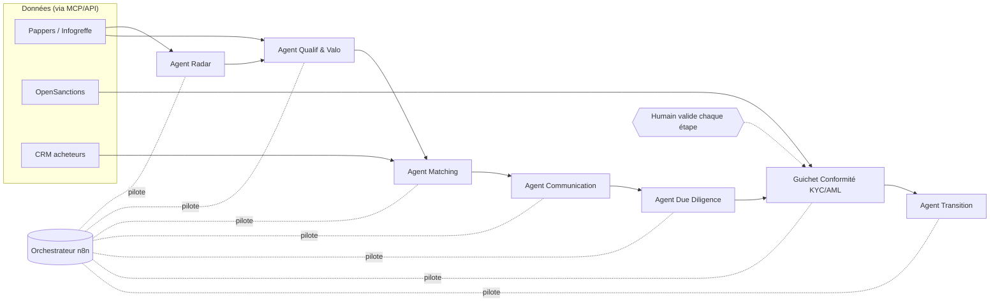
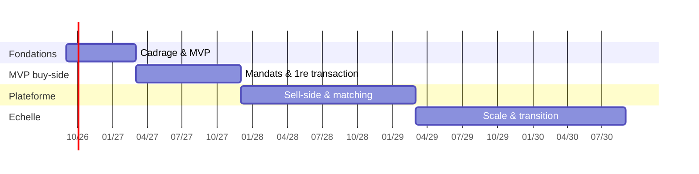

# Projet Capstone — AI for Business (PSTB)
## Pérennis — Plateforme d'agents d'IA et conseil M&A pour la transmission d'entreprises en Europe

**Spécialisation :** AI for Business — Stratégie, Finance & M&A
**Étudiant :** Abdul Gueny Djeirkhanov · **Cohorte :** FR_AI_BIZ · Campus France
**Nature :** création d'entreprise réelle (le fondateur est commanditaire et consultant IA)
**Référentiel :** valide les blocs **BC01** (Définition du projet) et **BC04** (Pilotage du projet) du RNCP 40247

---

## Résumé exécutif

L'Europe fait face à une **crise silencieuse de la transmission d'entreprises** : des
centaines de milliers de PME rentables risquent de disparaître, non par échec, mais parce
que leurs dirigeants vieillissent **sans successeur**. En France, près de **500 000
dirigeants** partiront à la retraite (plus de **3 M d'emplois** en jeu) et **une entreprise
sur deux ne trouve pas de repreneur**. Le marché est déséquilibré : **3× plus de vendeurs
que d'acheteurs** — le facteur rare est **l'acheteur solvable et de confiance**.

**Pérennis** relie les deux rives : une **plateforme d'agents d'IA** détecte, valorise et
apparie les entreprises à céder (avec un **guichet de conformité** KYC/AML/sanctions et
l'humain dans la boucle), et un **réseau propriétaire d'acheteurs** de la CEI et du
Moyen-Orient — mon avantage (réseau, langue russe). S'y ajoute un accompagnement A→Z et un
**management de transition**.

**Impact :** sourcing **3,7× plus productif** (coût/cible −65 %), cycle ramené de > 12 mois
à < 6, et, à maturité (~50 M€/an de volume), ~**1,9 M€** de résultat net — dans un cadre
strictement conforme (RGPD, LCB-FT, sanctions, filtrage des IDE, EU AI Act).

---

# PARTIE 1 — Veille stratégique IA et analyse sectorielle

## 1.1 Dispositif de veille IA

**Méthodologie et sources :**
- **Rapports sectoriels :** BPCE L'Observatoire, Bpifrance Le Lab, DGE, CRA, Banque de
  France, KfW, Institut Sapiens, McKinsey/BCG (adoption IA).
- **Presse & experts :** publications M&A, deal sourcing, IA en finance.
- **Veille réglementaire :** EU AI Act, CNIL/RGPD, LCB-FT, **règlement UE de filtrage des IDE**.
- **Outils :** Perplexity/WebSearch, Feedly, Notion, alertes, newsletters spécialisées.
- **Couverture (exigée) :** concurrence (plateformes de deal sourcing), réglementation,
  technologies (agents IA, MCP), tendances sectorielles, et **RSE/éthique** (impact social
  de la transmission : préservation des emplois et du savoir-faire ; lutte anti-blanchiment).

**Conclusions :** l'IA générative est devenue **un standard** du M&A (voir 1.2) ; la
contrainte n'est plus technologique mais organisationnelle (données, conformité, confiance).
Le besoin de transmission est massif et durable, mais le marché est inefficace — ce qui
justifie une solution qui **augmente** la capacité d'un cabinet et **apporte les acheteurs
rares**.

## 1.2 Panorama sectoriel — 5 cas d'usage IA

| # | Acteur | Problème | Solution IA | Résultat mesurable | Leçon pour Pérennis |
|---|---|---|---|---|---|
| 1 | **Cyndx** (deal origination) | trouver des cibles avant qu'elles soient sur le marché | algorithme « Projected to Raise » (NLP + base mondiale) | prédit le besoin de capital avec **~86 % de précision** | → notre agent **Radar** (sourcing prédictif) |
| 2 | **Sourcescrub** | sourcer des PME détenues par leur fondateur | agrégation de signaux (conférences, presse, listes) | pipelines propriétaires pour fonds PE | → sourcer **au-delà des registres** |
| 3 | **Marché M&A (2025)** | efficacité des deals | intégration de la GenAI dans les workflows | **86 %** des responsables l'ont intégrée, **65 %** dans la dernière année | l'approche IA est **dé-risquée**, déjà adoptée |
| 4 | **Cabinets de due diligence** (ex. EthosData) | DD lente, risques manqués | IA qui lit les contrats et signale les anomalies | DD plus rapide, moins d'oublis | → notre agent **Due Diligence** |
| 5 | **RegTech KYC/AML** (ComplyAdvantage, Sanction Scanner) | criblage manuel long et risqué | screening automatisé sanctions & PEP | conformité à l'échelle | → notre agent **Conformité** |

## 1.3 Leviers de performance (AI Traffic Light)

Positionnement : **Innovation** (marché transfrontalier inédit adossé à l'IA) **+
Augmentation** (l'IA démultiplie une petite équipe). Leviers visés : **efficacité
opérationnelle**, **scalabilité**, **qualité** (données ancrées), **conformité** (guichet
automatisé). Ce n'est pas une automatisation intégrale : décisions et relations restent
humaines.

---

# PARTIE 2 — Analyse du besoin et idéation

## 2.0 La commande du commanditaire

- **Commanditaire :** le comité de fondation de Pérennis (moi, fondateur, mandatant le
  consultant IA que je suis également).
- **Mission (une phrase) :** *« Concevoir et prototyper une solution d'IA qui détecte les
  PME européennes à céder sans successeur et les met en relation, en toute conformité, avec
  des acheteurs vérifiés de la CEI et du Moyen-Orient. »*
- **Contraintes :** budget d'amorçage modeste ; conformité stricte (RGPD, LCB-FT,
  sanctions, IDE) ; confidentialité M&A ; humain dans la boucle ; outils no-code/standard.
- **Livrables attendus :** un prototype fonctionnel, un business case, un plan de pilotage.

## 2.1 Analyse du besoin

- **Organisation cible :** cabinet M&A boutique + plateforme, opérant sur le marché européen
  de la cession-transmission (France d'abord).
- **Pain point mesurable :** > 12 mois de recherche, 42 % de cessions échouées faute
  d'acheteur, 3× plus de vendeurs que d'acheteurs.
- **Parties prenantes & attentes :** cédants (prix, discrétion, continuité) · repreneurs
  (cibles vérifiées, langue, gestion à distance) · régulateur (conformité) · équipe interne.
- **Hiérarchisation des besoins (priorité) :** 1) apporter des **acheteurs solvables** ;
  2) **conformité** irréprochable ; 3) **sourcing** efficace ; 4) accompagnement A→Z ;
  5) management de transition.
- **Conformité du besoin :** traite des données personnelles (dirigeants, acheteurs) →
  base légale RGPD requise ; usage à **risque limité** au sens de l'EU AI Act (voir 4.4).

*(Brief client d'une page — Annexe A.)*

## 2.2 Session d'idéation

**Persona 1 — Cédant :** Jean-Pierre Rousseau, 64 ans, PME de mécanique de précision
(8 M€ CA, 45 salariés). *« Personne à qui transmettre ; je ne connais pas la valeur ; je
veux la discrétion. »*
**Persona 2 — Repreneur :** Timur A., 45 ans, Almaty/Dubaï, 3–10 M€ à investir. *« Je ne
connais pas le marché ; à qui faire confiance ; comment gérer à distance ? »*
**Persona 3 — Interne :** Léa, 29 ans, analyste M&A (sourcing).
**User journey (avant → après) :** de « > 12 mois, échec 42 % » à « acheteur vérifié,
cycle < 6 mois, teaser anonyme, conformité intégrée, transition assurée ».

**3 idées & sélection (critères 1–5) :**

| Critère | Pérennis (hybride) | SaaS de sourcing | Conciergerie buy-side |
|---|---|---|---|
| Impact | 5 | 3 | 4 |
| Exploite mon fossé | 5 | 1 | 5 |
| Différenciation | 5 | 2 | 4 |
| Effet démo | 5 | 3 | 4 |
| Faisabilité | 3 | 4 | 4 |
| Coût | 3 | 4 | 4 |
| **Total** | **26 ✅** | 17 | 25 |

**Décision :** l'hybride Pérennis (seul à exploiter le fossé et l'effet plateforme),
**lancé par phases** — MVP conciergerie buy-side d'abord.

## 2.3 Définition de la solution retenue

- **Nom & pitch :** *Pérennis — « Assurer la pérennité des entreprises qui ont fait l'Europe. »*
- **Description :** plateforme d'agents d'IA (sourcing, valorisation, matching, conformité,
  communication, due diligence, transition) + conseil M&A humain.
- **Utilisateurs & bénéfices :** cédants (vendre vite, bien, discrètement) · repreneurs
  (entrer sur le marché UE en confiance) · équipe (démultipliée par l'IA).
- **Type d'IA mobilisée :** **agents d'IA** (orchestrés par n8n) + **IA générative** (Claude,
  multilingue, analyse documentaire) + **automatisation** ; scoring à base de règles.
- **Données nécessaires & disponibilité :** registres publics (Pappers, Infogreffe, BODACC,
  INSEE — **disponibles via API**), CRM acheteurs (interne), listes sanctions/PEP
  (OpenSanctions — **ouvertes**), documents de deal (fournis, sous NDA).

---

# PARTIE 3 — Benchmark des outils IA / No-Code

## 3.1 Benchmark comparatif

| Outil | Catégorie | Fonctionnalités clés | Performance | Interopérabilité | Coûts | Limites |
|---|---|---|---|---|---|---|
| **Base44** | App no-code | app depuis un prompt, UI, CRM | rapide | API/webhooks, MCP | freemium | moins de contrôle logique |
| **n8n** | Automatisation / agents | workflows, AI Agent, auto-hébergé UE | fiable | **connecte Claude, Pappers, Airtable…** (natif) | open-source / cloud | courbe d'apprentissage |
| **Claude** | LLM | multilingue RU/AR/FR/EN, documents | qualité élevée | API, **MCP**, appelable par n8n | à l'usage (tokens) | coût au volume |
| **Pappers** | Données entreprises | dirigeants, âge, finances | temps réel | **API REST** (branchée à n8n) | 100 crédits gratuits puis packs | finances parfois partielles |
| **OpenSanctions** | Conformité | sanctions & PEP (UN/OFAC/EU/UK) | à jour | API / données ouvertes | gratuit/pro | nécessite interprétation |

*Interopérabilité — exemple concret :* dans n8n, un nœud HTTP interroge **Pappers**, le
résultat est scoré, puis envoyé à **Claude** pour rédiger un mémo, et écrit dans **Airtable**
— tout est relié via API/**MCP**, sans vendor lock-in.

## 3.2 Stack retenue & architecture

> **Base44** (interface) + **n8n** (orchestration, UE) + **Claude** (moteur) +
> **Pappers/Infogreffe** (données) + **OpenSanctions** (conformité), reliés par **MCP**.

---

# PARTIE 4 — Cadrage du projet et Business Case

## 4.1 Note de cadrage

- **Périmètre — inclus :** sourcing, valorisation, matching, conformité, accompagnement
  A→Z, management de transition. **Exclu :** clôture automatisée, signature juridique
  (notaire), détention de fonds (séquestre).
- **Objectifs SMART :**
  - Livrer un **agent Radar fonctionnel** (n8n + Pappers) — *fait* ✅.
  - Atteindre **≥ 150 cibles qualifiées/mois** par analyste d'ici la fin du MVP (mois 6).
  - Signer **2–3 mandats acheteurs** en Phase 1 (mois 6–15).
  - **1ʳᵉ transaction** conclue au **mois 9–15**.
  - **0 incident de conformité** dès le premier jour.
- **Parties prenantes :** sponsor (fondateur), utilisateurs (analystes, cédants, repreneurs),
  équipe projet, partenaires (notaires, avocats, banques).
- **Contraintes :** techniques (quotas API), budgétaires (amorçage), humaines (petite
  équipe), temporelles (cycles longs).
- **Risques & atténuation :** voir tableau 4.4 et Partie 5.

## 4.2 Business Plan IA

**Coûts (régime cible, annuel) :** équipe ~350 k€ · **coûts IA/outils ~60 k€** · conformité
externe ~60 k€ · BD/déplacements ~80 k€ · admin ~50 k€ → **~600 k€**.

**Coûts IA spécifiques (détail) :**

| Poste | Estimation |
|---|---|
| API Pappers (crédits de recherche) | 100 gratuits, puis ~€/pack selon volume |
| Claude API (tokens : mémos, matching, rédaction) | ~200–500 €/mois au MVP |
| n8n (hébergement UE) + Base44 | ~50–150 €/mois |
| OpenSanctions | gratuit → pro à l'échelle |
| **Total IA au MVP** | **~300–800 €/mois** |

**Bénéfices :** gain de temps (sourcing ×3,7), moins d'erreurs (grounding), nouveaux revenus
(honoraires), satisfaction (cycle < 6 mois).

**ROI à 6 et 12 mois :**
- **6 mois :** phase d'investissement (build + pipeline) ; ROI **opérationnel** déjà visible
  via l'efficacité — **coût par cible qualifiée −65 %** ; premiers mandats signés.
- **12 mois :** 1ʳᵉ(s) transaction(s) en cours de closing → premiers **honoraires de succès**
  + retainers ; retour vers l'**équilibre** de l'investissement d'amorçage (~120 k€).
- À maturité (an 2–3) : produits ~2,49 M€, charges ~0,6 M€ → **~1,9 M€ net** (marge ~76 %).

**Pourquoi maintenant :** la vague de transmission est à son pic (2025–2035), l'IA en M&A
vient d'atteindre l'adoption de masse, et l'instabilité géopolitique pousse les capitaux de
l'Est vers l'UE. La fenêtre est ouverte.

## 4.3 Macroplanning (jalons & charges)

| Phase | Période | Jalons | Charge (j-h) |
|---|---|---|---|
| **Cadrage & Fondations** | Mois 0–6 | structure, marque, conformité, **MVP** | ~120 |
| **MVP buy-side & tests** | Mois 6–15 | mandats signés, **1ʳᵉ transaction** | ~180 |
| **Plateforme bilatérale** | Mois 15–30 | base sell-side, matching, équipe, CNCFA | ~260 |
| **Échelle & transition** | Mois 30–48 | Orbis, réseau interim, nouveaux marchés | ~300 |

## 4.4 Conformité éthique et réglementaire

- **RGPD :** données de dirigeants et d'acheteurs traitées → **base légale** (intérêt
  légitime / consentement), minimisation, hébergement **UE**, registre des traitements, DPO,
  droits des personnes.
- **EU AI Act — classification :** système à **risque limité** (recherche, appariement,
  génération assistée) → obligations de **transparence** et de supervision humaine. Nous
  appliquons **volontairement** une gouvernance de niveau supérieur (documentation, logs,
  human-in-the-loop) vu les enjeux financiers. Aucune notation de crédit de particuliers
  (usage à haut risque) n'est réalisée.
- **Analyse des biais & mitigation :** risque de biais du sourcing (sur-pondérer certains
  secteurs/régions) et de la valorisation → **mitigation** : ancrage sur données officielles,
  sources diversifiées, seuils revus par un humain, suivi des écarts.
- **Principes éthiques :** transparence (brouillons IA signalés), équité, **human-in-the-loop**
  (aucune action client sans validation), « uniquement des fonds licites ».
- **Limites de l'IA :** hallucinations (chiffres inventés), données périmées, excès de
  confiance dans un score, dépendance → gérées par grounding + validation humaine.

**Risques principaux & atténuation :**

| Risque | Mesure |
|---|---|
| Sanctions / réputation (capitaux CEI) | KYC strict, refus au moindre doute, origine des fonds documentée |
| Réglementaire (IDE, secteurs) | vérification juridique en amont, notification si requis |
| Confidentialité | NDA, teasers anonymisés, VDR |
| Trésorerie (deals longs) | retainers + transition |
| Erreurs IA | grounding + humain |
| Dépendance au fondateur | institutionnalisation (équipe, CNCFA, marque) |

---

# PARTIE 5 — Plan de pilotage et gouvernance

*(Détail complet : fichier `12-Partie5-Pilotage-projet-Agile-FR.md`. Synthèse ci-dessous.)*

## 5.1 Méthode de pilotage
**Agile hybride** : **Scrum** (produit, sprints de 2 semaines) + **Kanban** (flux des
affaires). Choix justifié par l'incertitude produit, la petite équipe et l'impératif de
conformité (intégrée à la *Definition of Done*).

## 5.2 Organisation de l'équipe
Rôles : Product Owner/Fondateur · Dév no-code/automatisation · Data/AI Analyst · Analyste
M&A · Responsable conformité · partenaires externes. **Communication :** daily 15 min,
Slack + Notion, canaux `#produit #deals #conformité #général`. **Dépendances** pilotées via
un board (ex. : un deal ne passe pas en Négociation sans feu vert Conformité).

## 5.3 Itérations
6 sprints / 12 semaines : Radar ✅ → CRM → Deal Room → Matching → Conformité →
Communication+démo. **Backlog priorisé** (Haute/Moyenne/Basse), **burn-down**, revues de
sprint avec un cédant et un repreneur test, retours réintégrés au backlog.

## 5.4 Tableau de bord de pilotage
Indicateurs **quantitatifs** (avancement, délais, budget, tokens API) et **qualitatifs**
(satisfaction, qualité, performance équipe) ; alertes (quota, sanctions) ; actions
correctives ; **montée en compétences** (formation, pairing, doc dans le dépôt GitHub).

## 5.5 Clôture & REX
Transfert de connaissances (GitHub, README, Notion) ; REX (Radar livré vite ; MCP portable ;
données Pappers partielles → enrichissement ; cycles longs → trésorerie) ; recommandations
de passage à l'échelle (Partie 7.2).

---

# PARTIE 6 — Prototype et démonstration technique

## 6.1 Prototype réalisé

Deux livrables fonctionnels : **(A) Agent Radar** — un workflow **n8n** connecté à l'**API
Pappers** qui détecte des PME rentables à dirigeant âgé et calcule un **score de succession**
(prototype de type *Workflow automatisé + Agent IA*, réellement exécutable) ; **(C) « Pérennis
Deal Room »** — maquette d'app no-code (pipeline kanban, fiche cible, guichet de conformité).

## 6.2 Documentation technique

- **Architecture :** voir schéma 3.2 (agents orchestrés par n8n, données via MCP/API).
- **Outils & justification :** n8n (orchestration, UE), Pappers (données FR), Claude
  (rédaction/multilingue), OpenSanctions (conformité), Base44 (UI).
- **Prompts clés documentés :** prompt de construction Base44 (cadre BASE) ; prompts système
  des agents **Radar, Matching, Communication, Conformité** (fichier `07`). Le code de
  scoring du Radar est dans `prototype/radar-pappers-n8n.json`.
- **Captures d'écran :** maquette Deal Room + résultats du Radar *(Annexe C)*.
- **Difficultés & solutions :** doc Pappers protégée (403) → paramètres validés via
  dépôts open-source ; finances parfois absentes → filtres `resultat_min`/`chiffre_affaires_min`
  garantissant la rentabilité + code défensif.
- **Limites & améliorations :** enrichissement financier par SIREN, passage en Schedule
  Trigger (Radar quotidien), écriture directe dans un CRM, agent Matching.

## 6.3 Vidéo de démonstration (3–5 min)

Script prêt à enregistrer (fichier `10`) : problème → pont → démo Deal Room (fiche cible →
matching → **guichet de conformité** → pipeline) → conformité & humain dans la boucle →
conclusion. Une **démo auto-jouée sous-titrée** existe (`prototype/perennis-demo.html`).

---

# PARTIE 7 — Pitch final et recommandations

## 7.1 Pitch Deck (13 slides)

Titre · Problème · Marché · Insight (3×) · Solution · Mon fossé · Agents IA · Technologie/MCP
· ROI de l'IA · Modèle économique · Conformité (avantage) · Feuille de route · Vision.
*(Fichier `prototype/perennis-pitch.html`.)*

## 7.2 Recommandations de déploiement

- **Feuille de route 6–12 mois :** MVP buy-side (2–3 acheteurs + Radar) → 1ʳᵉ transaction →
  base sell-side.
- **Facteurs clés de succès :** conformité irréprochable, réseau d'acheteurs actif, réseau de
  partenaires (notaires/avocats/banques), confiance des cédants.
- **Conduite du changement :** formation de l'équipe (prompt engineering, n8n, LCB-FT),
  positionnement de l'IA comme **assistant** (pas remplaçant), documentation vivante.
- **Indicateurs post-déploiement :** volume de transactions, cycle moyen, taux de conversion
  mandat→closing, satisfaction cédant/repreneur, **0 incident de conformité**.

---

# ANNEXES

- **Annexe A — Brief client (1 p.) :** commanditaire, mission (une phrase), contraintes,
  livrables (voir 2.0).
- **Annexe B — Personas :** Jean-Pierre (cédant), Timur (repreneur), Léa (analyste).
- **Annexe C — Captures :** maquette Deal Room (KPI, pipeline, fiche cible, guichet de
  conformité), résultats de l'agent Radar.
- **Annexe D — Prototype technique :** `radar-pappers-n8n.json` (workflow), prompts des agents.
- **Annexe E — Sources :** BPCE L'Observatoire · Bpifrance Le Lab · DGE · CRA · Banque de
  France · KfW · Institut Sapiens · EthosData/IMAA (IA en M&A) · Cyndx/Sourcescrub ·
  Freshfields (filtrage des IDE).

---

*Ce dossier valide les blocs BC01 et BC04 du RNCP 40247 — formation AI for Business, PSTB.*
